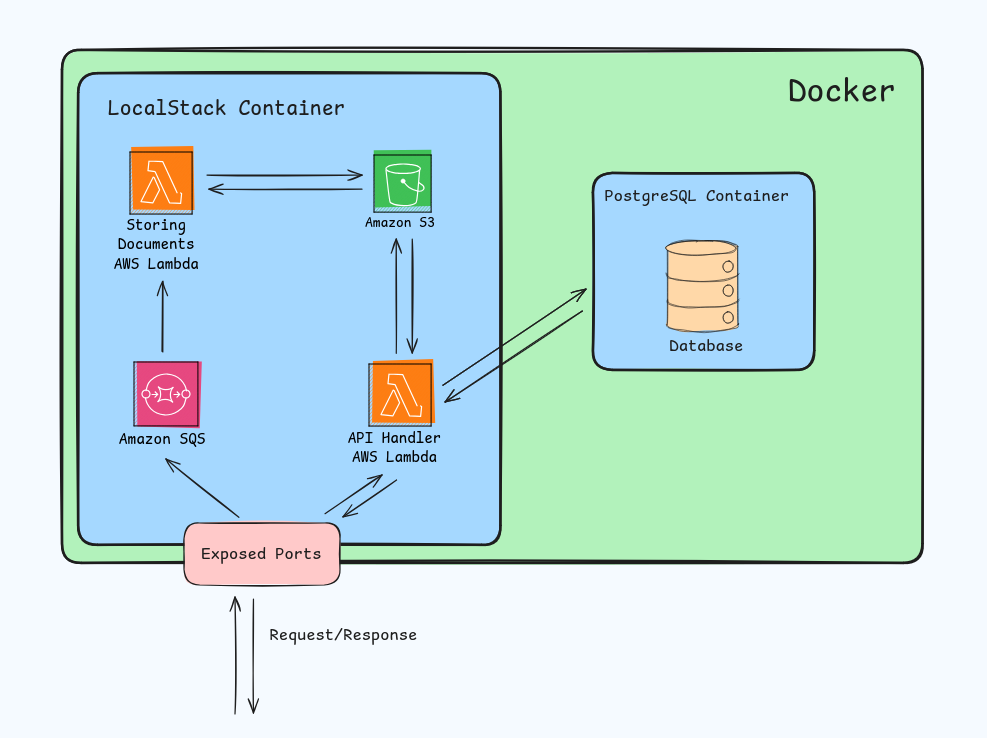
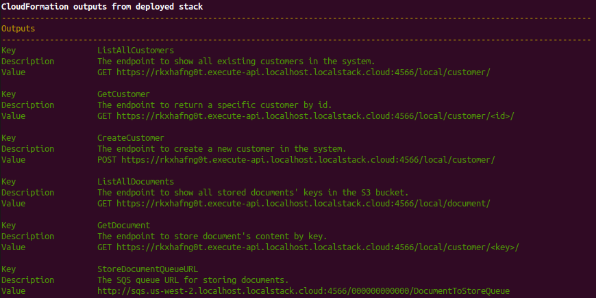
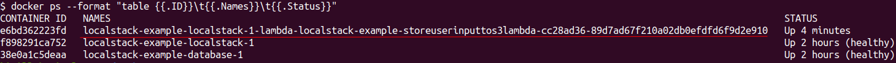
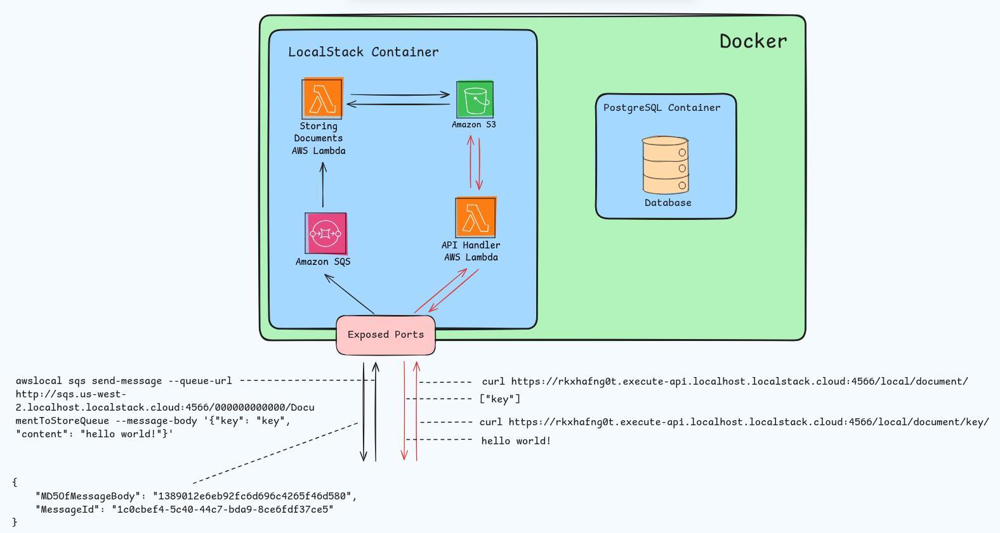
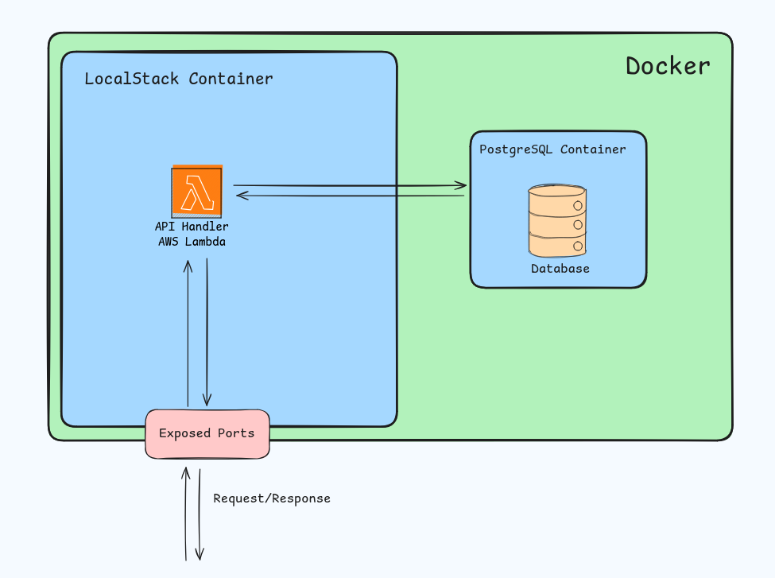

# Localstack Example

## Overview

This project shows how you can utilize the [Localstack](https://docs.localstack.cloud/getting-started/) to simulate the AWS platform locally.

The application provides the following set of features:
* Creating and storing a new customer in the database
* Retrieve a specific user or all users from the database
* Handle a [SQS](https://docs.aws.amazon.com/AWSSimpleQueueService/latest/SQSDeveloperGuide/welcome.html) event to store a document to the [S3](https://docs.aws.amazon.com/AmazonS3/latest/userguide/Welcome.html) bucket
* Get all existing keys from the S3 bucket
* Get a specific document's content by its key

The application logic is implemented via [AWS Lambda Functions](https://docs.aws.amazon.com/lambda/latest/dg/welcome.html).

All the infrastructure is handled by the [Docker Compose](https://docs.docker.com/compose/).

The AWS infrastructure is described via [AWS SAM](https://docs.aws.amazon.com/serverless-application-model/latest/developerguide/what-is-sam.html).

Here is a diagram that shows how it is working at the high-level:




## Setup

### Clone the Repository

First of all, you need to clone the repository:
```shell
$ git clone
```

### Install Dependencies

After this, create a virtual environment and install dependencies from the `requirements.txt` file:
```shell
$ python3.10 -m venv venv
$ . venv/bin/activate
$ pip install -r requirements.txt
```

### Project Configuration

The application configuration is done by the `.env.local` file:
```shell
# ========================================
# ===== INFRASTRUCTURE CONFIGURATION =====
# ========================================

# ==== DOCKER POSTGRES
export DOCKER_POSTGRES_PORT_EXPOSE=6000

# ==== DOCKER LOCALSTACK
export DOCKER_LOCALSTACK_GATEWAY_PORT_EXPOSE=4566
export DOCKER_LOCALSTACK_EXTERNAL_SERVICES_PORT_RANGE_EXPOSE="4510-4559"

# ==== POSTGRES
export POSTGRES_USER=dev
export POSTGRES_PASSWORD=devdev
export POSTGRES_DB=localstack_example


# =====================================
# ===== APPLICATION CONFIGURATION =====
# =====================================

# ==== DATABASE
export DATABASE_USER=${POSTGRES_USER}
export DATABASE_PASSWORD=${POSTGRES_PASSWORD}
export DATABASE_NAME=${POSTGRES_DB}
export DATABASE_PORT=5432
export DATABASE_HOST=database

# ==== S3 BUCKET
export S3_DOCUMENTS_BUCKET=documents
```

Probably, you will be interested in only `DOCKER_POSTGRES_PORT_EXPOSE`, `DOCKER_LOCALSTACK_GATEWAY_PORT_EXPOSE` and `DOCKER_LOCALSTACK_EXTERNAL_SERVICES_PORT_RANGE_EXPOSE`.
These ports are exposed for docker containers to the host machine. So, if you have ports collisions, change these ports to the appropriate ones.

Here is a complete description of these variables:
* `DOCKER_POSTGRES_PORT_EXPOSE` - The port number that is being exposed to the host machine for the postgres database container
* `DOCKER_LOCALSTACK_GATEWAY_PORT_EXPOSE` - The port number that is being exposed to the host machine for the localstack container
* `DOCKER_LOCALSTACK_EXTERNAL_SERVICES_PORT_RANGE_EXPOSE` - The range of port numbers that are exposed to the host machine for the localstack container's services
* `POSTGRES_USER` - The postgres user that is created in the postgres database container
* `POSTGRES_PASSWORD` - The password that is assigned to the user in the postgres database container
* `POSTGRES_DB` - The database that will be created in the postgres database container
* `DATABASE_USER` - The user that is used to connect to the postgres database container
* `DATABASE_PASSWORD` - The user's password that is used to connect to the postgres database container
* `DATABASE_NAME` - The database's name to connect
* `DATABASE_PORT` - The database's port to connect
* `DATABASE_HOST` - The database's host to connect

### Scripts

The `.env.local` file also has a bunch of scripts that are used during development & local deployment. Let's take a look at them:
```shell
# ==== DEVELOPMENT SCRIPTS
new-migration-file() (
  ...
)

run-migrations() (
  ...
)

# ==== INFRASTRUCTURE SCRIPTS
app-up() (
  ...
)

app-down() (
  ...
)

build-lambdas() (
  ...
)

infra-up() (
  ...
)

deploy-lambdas() (
  ...
)
```

Scripts do the following things:
* `new-migration-file` - generates a new migration file template
* `run-migrations` - runs migrations against the database that is being run in the docker container
* `app-up` - starts the application locally. Can take some time to set up infrastructure locally (build lambdas, deploy them, run migration files, etc.)
* `app-down` - stops the application and removes used docker volumes
* `build-lambdas` - builds lambdas using AWS SAM and storing artifacts to the `.aws-sam/` directory
* `infra-up` - starts the infrastructure components - localstack & database
* `deploy-lambdas` - deploys all built lambdas to the localstack
 
## Demo

Firstly, make preparations that are in the [Setup](#Setup).

Start the application locally by calling the `app-up` command. Before this, load the `.env.local` file to your shell:
```shell
$ source .env.local
$ app-up
```
Probably, it will take some time. Wait until the command is finished.

Finally, you will see the following output in your terminal:


This output shows available endpoints that you can use to interact with the application.

Let's send some requests and see how it works.

In the examples below, specify your endpoints because they will differ from those on the screen above.

### Documents

The document endpoints provide functionality to create and retrieve documents from the S3 bucket.

The picture above provides several endpoints for interaction with documents in our system.

Let's see what documents exist. Execute the following command (replace the actual endpoint with yours):
```shell
$ curl https://rkxhafng0t.execute-api.localhost.localstack.cloud:4566/local/document/
[]
```

The output will be an empty list. Because we haven't stored any documents yet, the output is the empty list.

Let's fix this and create a new one:
```shell
$ awslocal sqs send-message --queue-url http://sqs.us-west-2.localhost.localstack.cloud:4566/000000000000/DocumentToStoreQueue --message-body '{"key": "key", "content": "hello world!"}'
```

This command pushes a new event to the SQS queue that is being "listened" by the AWS lambda function. When the queue receives a new event, it triggers
the lambda function that processes the event.

After you execute the command above, you will receive a message similar to this one:
```shell
{
    "MD5OfMessageBody": "1389012e6eb92fc6d696c4265f46d580",
    "MessageId": "1c0cbef4-5c40-44c7-bda9-8ce6fdf37ce5"
}
```

If you run the `docker ps` you will see that a new docker container has appeared:


It is a new lambda container that handles the logic of storing a document to the S3 by the key that you've provided and the content that you've specified.

Let's verify that the document actually is being stored:
```shell
$ curl https://rkxhafng0t.execute-api.localhost.localstack.cloud:4566/local/document/
["key"]
```

It is! Let's retrieve its content:
```shell
$ curl https://rkxhafng0t.execute-api.localhost.localstack.cloud:4566/local/document/key/
hello world!
```

The response shows the same string that you've specified for the document under `key`.

Here is a diagram of the flow, and how it works:



### Customers

The next part of the application is focused on customer management and storing them in the database.

Let's create a new customer by executing this command:
```shell
$ curl -X POST -H "Content-Type: application/json" -d '{"first_name": "John", "last_name": "Wick"}' https://rkxhafng0t.execute-api.localhost.localstack.cloud:4566/local/customer/
null
```

If you receive `null`, then customer is created.

Let's view all existing customers in our application:
```shell
$ curl https://rkxhafng0t.execute-api.localhost.localstack.cloud:4566/local/customer/
[
  {
    "id": 1,
    "first_name": "John",
    "last_name": "Wick"
    }
]
```

Great! The customer is stored, and we can see it in the customers list.

We have an additional endpoint, to retrieve information only about a specific customer. We specify `id` in the end to retrieve information about a specific user:
```shell
$ curl https://rkxhafng0t.execute-api.localhost.localstack.cloud:4566/local/customer/1/
{
  "id": 1,
  "first_name": "John",
  "last_name": "Wick"
}
```

If we specify a non-existing `id` we will receive the following output:
```shell
$ curl https://rkxhafng0t.execute-api.localhost.localstack.cloud:4566/local/customer/2/
null
```

So, an infrastructure that is managed by the LocalStack can also communicate with external microservices that are in the same network.

As you remember, lambdas are created dynamically as a new docker container, and they are connected to the same network where LocalStack is.

Here is a diagram of this workflow:



## AWS SAM

You can interact with LocalStack in various ways: common CLI commands, web UI, etc.

In this project, we use an AWS solution to describe our AWS infrastructure as code - AWS SAM.

Basically, you describe your infrastructure in some `.yaml` file, and all the remaining work is done under the hood by the `sam` cli.

Because LocalStack emulates the AWS environment locally, you can also describe your infrastructure with this tool and deploy it to the LocalStack.

Look at [template.yaml](template.yaml) file to see how we describe our application.

## AWS Lambdas

Our lambdas are stored in the [src/lambdas](./src/lambdas) folder. We've created two lambda functions that handle
the application logic.

We point to them from the `template.yaml` file. so AWS SAM knows how to build our lambdas and where to seek lambdas
source code.